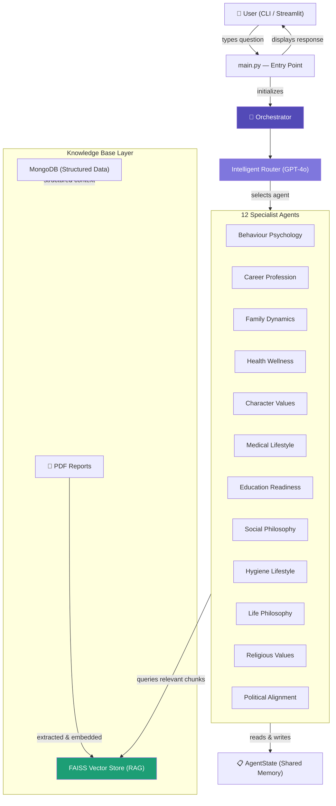
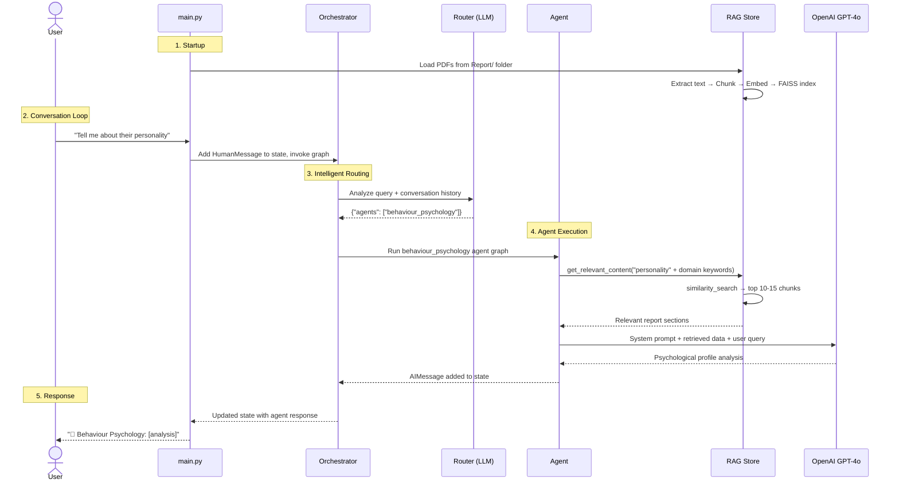
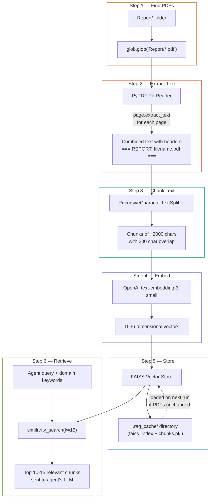
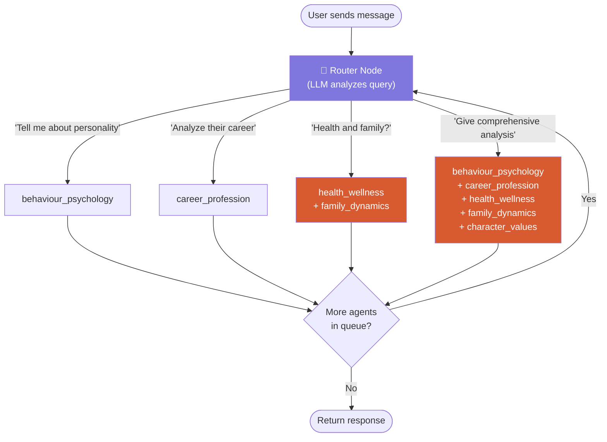
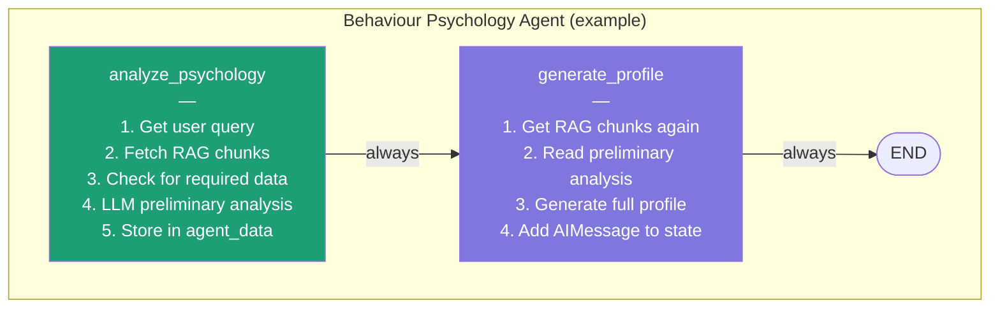
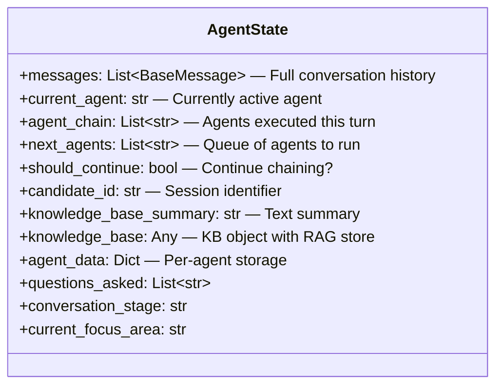
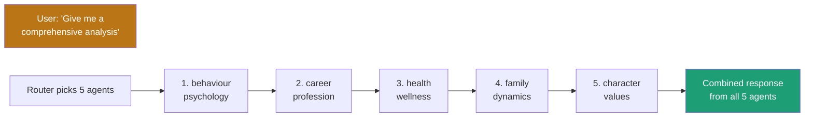

# Multi-Agent Pre-Marriage Counseling System

An AI-powered counseling platform built with **LangGraph** that uses **12 specialized agents** orchestrated by an intelligent router to analyze candidate compatibility across psychological, career, health, family, and value dimensions.

---

## Table of Contents

- [What Does This Project Do?](#what-does-this-project-do)
- [High-Level Architecture](#high-level-architecture)
- [How the System Works (Step by Step)](#how-the-system-works-step-by-step)
- [PDF Loading & RAG Indexing Pipeline](#pdf-loading--rag-indexing-pipeline)
- [The Orchestrator & Intelligent Routing](#the-orchestrator--intelligent-routing)
- [How a Specialist Agent Works Internally](#how-a-specialist-agent-works-internally)
- [State Management](#state-management)
- [Multi-Agent Chaining](#multi-agent-chaining)
- [Project Structure](#project-structure)
- [Key Technologies Used](#key-technologies-used)
- [Setup & Installation](#setup--installation)
- [Interview-Ready Q&A](#interview-ready-qa)

---

## What Does This Project Do?

Imagine a marriage counseling service where, instead of one counselor, you have **12 expert specialists** — a psychologist, a career advisor, a family therapist, a health expert, and more — all collaborating to evaluate a candidate's readiness for marriage.

This system takes **PDF reports** about a candidate (psychometric tests, medical records, family background, etc.), **indexes them using RAG (Retrieval-Augmented Generation)**, and lets users ask questions. An intelligent router automatically sends each question to the right specialist agent(s), who retrieve only the relevant parts of the reports and generate insightful analysis.

---

## High-Level Architecture



---

## How the System Works (Step by Step)



---

## PDF Loading & RAG Indexing Pipeline

This is how raw PDF files become queryable knowledge for the agents.

### The 6-Step Pipeline



### Why RAG Instead of Sending Full Text?

| Without RAG | With RAG |
|---|---|
| Send entire 100k+ char document to LLM | Send only 10-15 relevant chunks (~30k chars) |
| Hits token limits, fails | Stays within limits |
| All agents see all data | Each agent sees domain-specific data |
| Expensive (many tokens) | Cost-effective (fewer tokens) |
| Slow response | Fast, focused response |

### How Chunks Overlap

```
PDF Text:  [...paragraph about RRI scores...][...paragraph about communication...]

Chunk 1:   |=== 2000 chars ===|
Chunk 2:              |==overlap==|=== 2000 chars ===|
                      ↑ 200 chars ↑

The overlap ensures no sentence is "cut in half" between chunks.
```

### Cache System

On first run, the system creates embeddings (takes ~30 seconds). It saves everything to `.rag_cache/`:
- `faiss_index/` — The vector store
- `chunks.pkl` — Pickled text chunks
- `index_metadata.json` — File names + modification times
- `raw_content.txt` — Combined raw text

On subsequent runs, it checks if any PDF was modified (via `mtime`). If not, it loads from cache in seconds.

---

## The Orchestrator & Intelligent Routing

The orchestrator (`orchestrator.py`) is the **brain** of the system. It builds a LangGraph with 14 nodes (1 router + 12 agents + END).

### How Routing Works



### Router Decision Process

1. Takes the user's latest message + last 3 messages of conversation history
2. Sends to GPT-4o with `ROUTER_SYSTEM_PROMPT` (which describes all 12 agents and their domains)
3. LLM returns JSON: `{"agents": ["behaviour_psychology", "family_dynamics"], "reasoning": "..."}`
4. Orchestrator queues the agents and executes them one by one
5. After each agent finishes, checks if more agents are in the queue
6. If yes → loops back to router → picks next agent. If no → END.

### Domain Keyword Enhancement

When an agent queries the RAG store, the system adds domain-specific keywords to improve retrieval:

| Agent | Added Keywords |
|---|---|
| `behaviour_psychology` | RRI PRI AntarBahya DISC 7WPD personality behavior communication emotional |
| `career_profession` | career job profession employment salary income work stress ambition |
| `medical_lifestyle` | medical health condition treatment medication chronic disease |
| `family_dynamics` | family parents siblings relationships family values culture |
| `health_wellness` | health wellness diet exercise fitness smoking addiction HRI |
| `character_values` | values ethics integrity morals character habits hobbies |

---

## How a Specialist Agent Works Internally

Each of the 12 agents has its own **mini-LangGraph** with 2 nodes.



### Agent Execution Flow

```python
# Simplified version of what happens inside each agent:

def _analyze_psychology(self, state):
    # 1. Extract user's question from messages
    user_query = get_latest_human_message(state["messages"])
    
    # 2. Get domain-specific content using RAG
    kb_summary = get_agent_specific_content(
        state=state,
        agent_domain="behaviour_psychology",
        user_query=user_query
    )
    
    # 3. Send to LLM with system prompt + retrieved data
    response = self.llm.invoke([
        SystemMessage(content=SYSTEM_PROMPT),
        HumanMessage(content=f"Analyze this data: {kb_summary}")
    ])
    
    # 4. Store preliminary analysis
    state["agent_data"]["behaviour_psychology"]["preliminary_analysis"] = response.content
    return state

def _generate_profile(self, state):
    # Uses preliminary analysis + RAG data to generate comprehensive profile
    # Adds final AIMessage to state["messages"]
    pass
```

---

## State Management

The `AgentState` is a Python `TypedDict` — a shared dictionary that **every component reads from and writes to**.



### How State Flows Through the System

```
User types "Analyze their career and health"
        │
        ▼
┌─ main.py ──────────────────────────────────┐
│  state["messages"].append(HumanMessage)     │
│  result = orchestrator.graph.invoke(state)  │
└────────────────────┬───────────────────────┘
                     ▼
┌─ Router ───────────────────────────────────┐
│  state["next_agents"] = ["career_...",     │
│                           "health_..."]    │
│  state["agent_chain"] = []                 │
└────────────────────┬───────────────────────┘
                     ▼
┌─ career_profession agent ──────────────────┐
│  state["agent_chain"] = ["career_..."]     │
│  state["agent_data"]["career_..."] = {...} │
│  state["messages"].append(AIMessage)       │
└────────────────────┬───────────────────────┘
                     ▼
┌─ _should_continue_chain ───────────────────┐
│  next_agents still has "health_..."        │
│  → return "continue"                       │
└────────────────────┬───────────────────────┘
                     ▼
┌─ health_wellness agent ────────────────────┐
│  state["agent_chain"] = ["career_...",     │
│                           "health_..."]    │
│  state["messages"].append(AIMessage)       │
└────────────────────┬───────────────────────┘
                     ▼
┌─ _should_continue_chain ───────────────────┐
│  next_agents is empty → return "end"       │
└────────────────────────────────────────────┘
```

---

## Multi-Agent Chaining

When a user asks a complex question that spans multiple domains, the system **chains** agents — running them one after another, each adding their analysis to the shared state.



Each agent in the chain:
1. **Reads** the shared state (including outputs from previous agents)
2. **Queries** the RAG store for its domain-specific data
3. **Generates** its analysis and appends an `AIMessage`
4. **Stores** its data in `state["agent_data"]["agent_name"]`

---

## Project Structure

```
Langgraph-agentic-workflow/
│
├── main.py                          # Entry point — chat loop
├── requirements.txt                 # Python dependencies
├── ikscbandhan_mongodb_schema_v5.xlsx  # MongoDB schema reference
│
├── app/
│   ├── agents/                      # 12 specialist agents + orchestrator
│   │   ├── orchestrator/
│   │   │   └── orchestrator.py      # Brain — builds graph, routes, chains
│   │   ├── behaviour_psychology/
│   │   │   └── agent.py             # Psychological analysis agent
│   │   ├── career_profession/
│   │   │   └── agent.py             # Career stability agent
│   │   ├── family_dynamics/
│   │   │   └── agent.py             # Family analysis agent
│   │   ├── health_wellness/         # ... and 9 more agents
│   │   └── ...
│   │
│   ├── prompts/                     # System prompts for each agent
│   │   ├── orchestrator/
│   │   │   └── router_prompt.py     # Routing rules + agent descriptions
│   │   ├── behaviour_psychology/
│   │   │   └── system_prompt.py     # DISC, 7WPD, AntarBahya frameworks
│   │   └── ...
│   │
│   ├── knowledge/                   # Data loading & retrieval
│   │   ├── knowledge_base.py        # Data models (Pydantic)
│   │   ├── loader.py                # PDF loading + MongoDB loading
│   │   ├── rag_store.py             # FAISS vector store + chunking
│   │   ├── rag_helper.py            # Agent-specific RAG retrieval
│   │   ├── mongodb_loader.py        # MongoDB PDF loader
│   │   ├── mongodb_service.py       # MongoDB structured data service
│   │   ├── summarizer.py            # LLM-based content summarization
│   │   └── utils.py                 # Sample knowledge base for testing
│   │
│   ├── models/                      # MongoDB v5 schema models
│   │   ├── primary_data.py          # Education, bio, profession
│   │   ├── secondary_data.py        # Social media, interests
│   │   ├── family_data.py           # Family members, values
│   │   ├── tertiary_data.py         # Friends/colleagues feedback
│   │   ├── operational_data.py      # Psychometric, medical, body language
│   │   ├── medical_data.py          # Detailed medical records
│   │   ├── marriage_data.py         # Marriage-related data
│   │   └── ...                      # 10+ model files
│   │
│   └── state/
│       └── state.py                 # AgentState TypedDict definition
│
├── streamlit_app/                   # Web UI (for debugging/testing)
│   ├── main_ui.py                   # Streamlit interface
│   └── requirements.txt
│
└── Report/                          # PDF reports go here (not in repo)
    ├── RRI_Assessment.pdf
    ├── Medical_Report.pdf
    └── ...
```

---

## Key Technologies Used

| Technology | Purpose | Where Used |
|---|---|---|
| **LangGraph** | State machine for agent workflows | `orchestrator.py`, every `agent.py` |
| **LangChain** | LLM abstraction, text splitting, embeddings | Throughout `knowledge/` and `agents/` |
| **OpenAI GPT-4o** | LLM for analysis and routing | Router + all 12 agents |
| **OpenAI Embeddings** | `text-embedding-3-small` for vectors | `rag_store.py` |
| **FAISS** | Fast vector similarity search | `rag_store.py` |
| **PyPDF** | PDF text extraction | `loader.py` |
| **Pydantic** | Data validation and models | `knowledge_base.py`, `models/` |
| **MongoDB** | Structured data storage (optional) | `mongodb_service.py`, `mongodb_loader.py` |
| **Streamlit** | Web UI for testing | `streamlit_app/` |

---

## Setup & Installation

### Prerequisites
- Python 3.8+
- OpenAI API key

### Steps

```bash
# 1. Clone the repository
git clone https://github.com/chetanmundhe2911/Langgraph-agentic-workflow.git
cd Langgraph-agentic-workflow

# 2. Install dependencies
pip install -r requirements.txt

# 3. Set up your OpenAI API key
# Option A: Create a .env file
echo "OPENAI_API_KEY=your_key_here" > .env

# Option B: Export as environment variable
export OPENAI_API_KEY=your_key_here

# 4. Add PDF reports to the Report/ folder
mkdir -p Report/
# Copy your candidate PDF reports here

# 5. Run the application
python main.py
```

### Running the Streamlit UI

```bash
cd streamlit_app
pip install -r requirements.txt
streamlit run main_ui.py
```

---

## Interview-Ready Q&A

### Q1: What is LangGraph and why is it used here?

**LangGraph** is a library for building stateful, multi-step AI workflows as directed graphs. Each node is a function that takes state in and returns state out. Edges define the execution order, and conditional edges let you route dynamically. In this project, LangGraph manages two levels of graphs — the **orchestrator graph** (which routes between agents) and each **agent's internal graph** (which has analyze → generate_profile steps).

### Q2: What is RAG and why not just send the full PDF?

**RAG (Retrieval-Augmented Generation)** is a technique where you first retrieve relevant document chunks, then send only those chunks to the LLM. We use it because candidate reports can be 100k+ characters — far too large for a single LLM call. RAG ensures each agent sees only the 10-15 most relevant paragraphs, saving tokens and improving accuracy.

### Q3: How does the intelligent router decide which agent to call?

The router sends the user's query + conversation history to GPT-4o with a system prompt that describes all 12 agents and their domains. The LLM returns a JSON response like `{"agents": ["behaviour_psychology", "family_dynamics"]}`. The orchestrator queues these agents and executes them sequentially.

### Q4: What is FAISS and how does similarity search work?

**FAISS (Facebook AI Similarity Search)** is an in-memory library for fast nearest-neighbor search in high-dimensional vector spaces. Each text chunk is converted to a 1536-dimensional vector by OpenAI's embedding model. When an agent queries, the query is also embedded, and FAISS finds the chunks whose vectors are closest (most similar in meaning) to the query vector.

### Q5: How does state flow between agents in a chain?

All agents share a single `AgentState` dictionary. When Agent A finishes, it writes its results to `state["agent_data"]["agent_a"]` and appends an `AIMessage` to `state["messages"]`. When Agent B runs next, it can read Agent A's output from the same state. This is how agents "collaborate" without directly calling each other.

### Q6: What happens when the system starts for the first time vs. subsequent runs?

**First run**: PDFs are read → text extracted → chunked → embedded → FAISS index created → saved to `.rag_cache/`. This takes ~30 seconds.
**Subsequent runs**: The system checks if any PDF was modified (via file modification timestamps). If unchanged, it loads the entire FAISS index from cache in ~1 second.

### Q7: What is the role of system prompts?

Each agent has a detailed system prompt (150-200 lines) that defines its domain expertise, analysis frameworks (like DISC, 7WPD for psychology), required input data, and expected output format. The router also has a system prompt that describes all 12 agents so it can make informed routing decisions.

### Q8: How would you add a 13th agent?

1. Create `app/agents/new_agent/agent.py` with a LangGraph (analyze → generate nodes)
2. Create `app/prompts/new_agent/system_prompt.py` with domain expertise
3. Import and register the agent in `orchestrator.py`
4. Add the agent to the router's system prompt description
5. Add domain keywords in `rag_store.py`'s `_get_domain_keywords()`
6. Add relevant MongoDB collections in `knowledge_base.py`'s `AGENT_DOMAIN_DATA_MAP`

---

## Data Flow Summary

```
PDF files → PyPDF → Raw text → Chunker → Embeddings → FAISS
                                                         ↓
User Question → Router (LLM) → Agent → RAG Query → similarity_search
                                          ↓                ↓
                                   System Prompt    Relevant Chunks
                                          ↓                ↓
                                       LLM (GPT-4o) ← Combined Input
                                          ↓
                                   Analysis Response → User
```

---

## License

This project is provided as-is for educational and development purposes.
