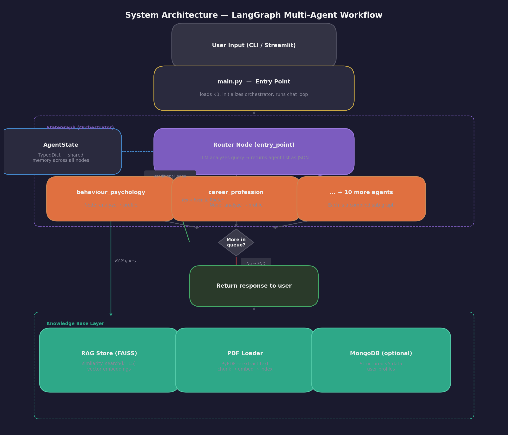
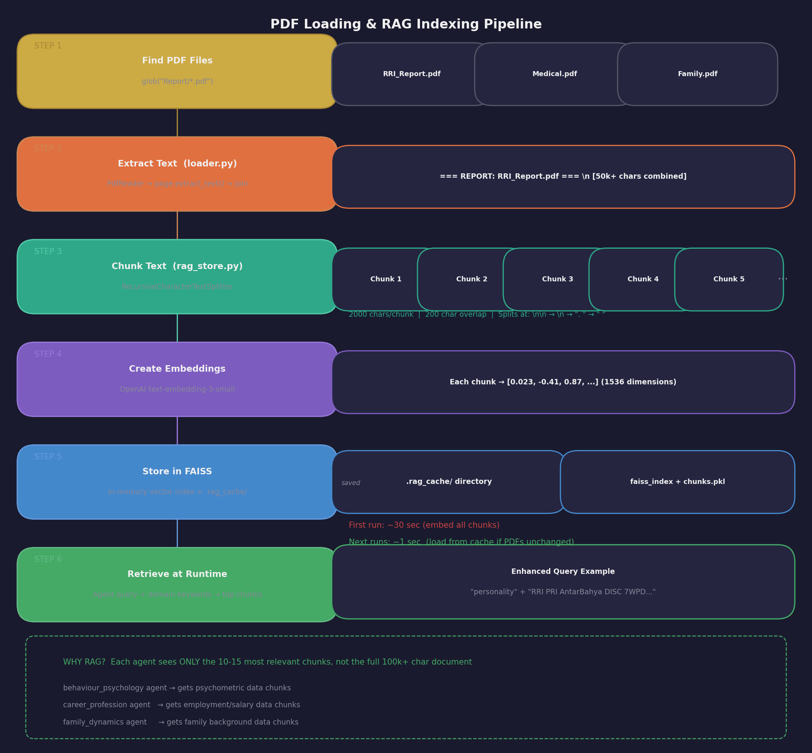
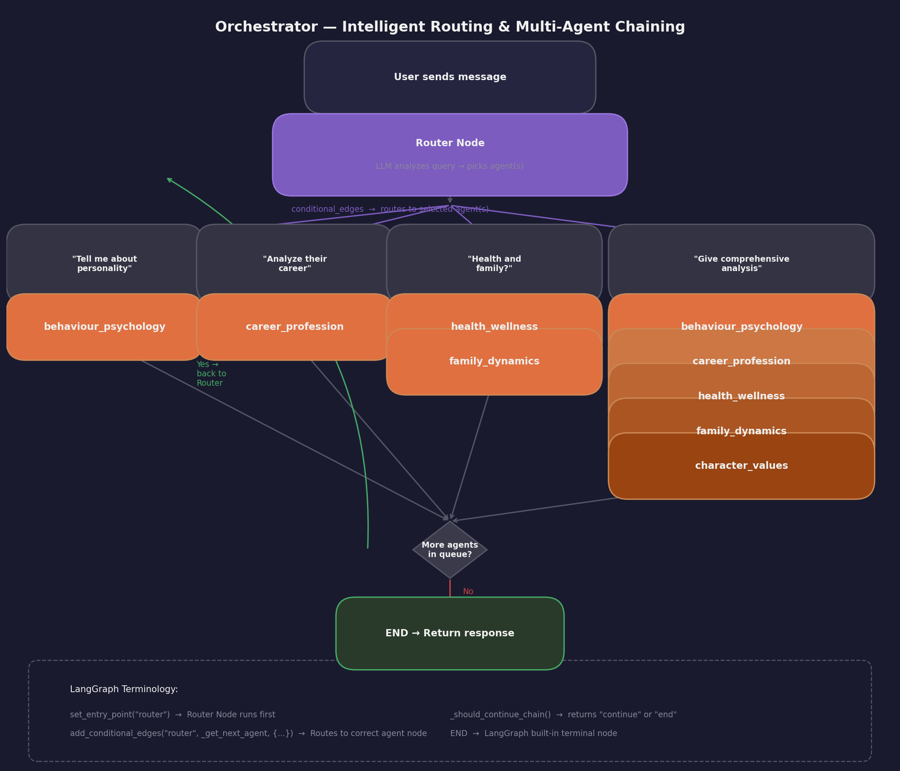
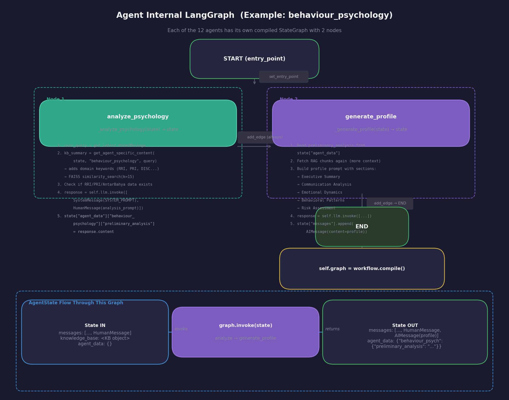

# Multi-Agent Pre-Marriage Counseling System

An AI-powered counseling platform built with **LangGraph** that uses **12 specialized agents** orchestrated by an intelligent router to analyze candidate compatibility across psychological, career, health, family, and value dimensions.

---

## Table of Contents

- [What Does This Project Do?](#what-does-this-project-do)
- [High-Level Architecture](#high-level-architecture)
- [How the System Works (Step by Step)](#how-the-system-works-step-by-step)
- [PDF Loading & RAG Indexing Pipeline](#pdf-loading--rag-indexing-pipeline)
- [The Orchestrator & Intelligent Routing](#the-orchestrator--intelligent-routing)
- [How a Specialist Agent Works Internally](#how-a-specialist-agent-works-internally)
- [State Management](#state-management)
- [Project Structure](#project-structure)
- [Key Technologies Used](#key-technologies-used)
- [Setup & Installation](#setup--installation)
- [Interview-Ready Q&A](#interview-ready-qa)

---

## What Does This Project Do?

Imagine a marriage counseling service where, instead of one counselor, you have **12 expert specialists** — a psychologist, a career advisor, a family therapist, a health expert, and more — all collaborating to evaluate a candidate's readiness for marriage.

This system takes **PDF reports** about a candidate (psychometric tests, medical records, family background, etc.), **indexes them using RAG (Retrieval-Augmented Generation)**, and lets users ask questions. An intelligent router automatically sends each question to the right specialist agent(s), who retrieve only the relevant parts of the reports and generate insightful analysis.

---

## High-Level Architecture



**How it connects:**

1. **User** types a question via CLI or Streamlit UI
2. **main.py** loads the knowledge base (PDFs into RAG) and starts the chat loop
3. **Orchestrator** receives the question and passes it to the **Intelligent Router**
4. **Router** (GPT-4o) analyzes the query and picks which agent(s) should handle it
5. Selected **Agent(s)** query the **RAG Store** for relevant PDF chunks, then generate analysis
6. **AgentState** (shared dictionary) carries conversation history and agent outputs throughout

---

## How the System Works (Step by Step)

Here is what happens when you type a question like *"Tell me about their personality"*:

```
Step 1: main.py adds your message to state["messages"]
Step 2: Orchestrator.graph.invoke(state) is called
Step 3: Router node analyzes your query with GPT-4o
Step 4: Router returns: {"agents": ["behaviour_psychology"]}
Step 5: behaviour_psychology agent runs its own mini-LangGraph:
        - analyze_psychology node: fetches relevant PDF chunks via RAG
        - generate_profile node: sends data + system prompt to GPT-4o
Step 6: Agent appends AIMessage to state["messages"]
Step 7: main.py displays the response to you
```

For multi-domain questions like *"Analyze career and health"*, steps 5-6 repeat for each agent in the chain (career_profession then health_wellness).

---

## PDF Loading & RAG Indexing Pipeline

This is the most important technical component — how raw PDFs become queryable knowledge.



### Step-by-Step Breakdown

**Step 1 — Find PDF files** (`loader.py`): Uses `glob.glob("Report/*.pdf")` to find all PDFs in the Report folder.

**Step 2 — Extract text** (`loader.py`): `PyPDF.PdfReader` reads every page of each PDF. All text gets combined into one string, separated by `=== REPORT: filename.pdf ===` headers.

**Step 3 — Chunk text** (`rag_store.py`): `RecursiveCharacterTextSplitter` breaks the combined text into ~2000-character chunks with 200-character overlap. The overlap ensures sentences at chunk boundaries are not lost. It splits at paragraph breaks first (`\n\n`), then sentences (`. `), then words.

**Step 4 — Create embeddings** (`rag_store.py`): Each chunk is sent to OpenAI's `text-embedding-3-small` model, which returns a 1536-dimensional vector — a list of numbers representing the chunk's meaning.

**Step 5 — Store in FAISS** (`rag_store.py`): All vectors go into a FAISS (Facebook AI Similarity Search) index for fast nearest-neighbor lookup. The index + chunks + metadata are cached to `.rag_cache/` so subsequent runs skip steps 2-4.

**Step 6 — Retrieve at runtime** (`rag_helper.py`): When an agent needs data, it sends a query enhanced with domain keywords (e.g., "RRI PRI AntarBahya DISC 7WPD" for psychology). FAISS finds the 15 most similar chunks — only the relevant data reaches the agent.

### Why RAG?

| Without RAG | With RAG |
|---|---|
| Send entire 100k+ char document to LLM | Send only 10-15 relevant chunks (~30k chars) |
| Hits token limits, fails | Stays within limits |
| All agents see all data | Each agent sees domain-specific data |
| Expensive (many tokens) | Cost-effective (fewer tokens) |

---

## The Orchestrator & Intelligent Routing

The orchestrator is the **brain** of the system. It decides which agent(s) handle each question and manages multi-agent chaining.



### How Routing Works

1. Takes the user's latest message + last 3 messages of history
2. Sends to GPT-4o with `ROUTER_SYSTEM_PROMPT` (describes all 12 agents and their domains)
3. LLM returns JSON: `{"agents": ["behaviour_psychology", "family_dynamics"], "reasoning": "..."}`
4. Orchestrator queues the agents and executes them one by one
5. After each agent: checks if more in queue. If yes, loops back. If no, END.

### Domain Keyword Enhancement

When an agent queries the RAG store, domain-specific keywords are added to improve retrieval:

| Agent | Added Keywords |
|---|---|
| `behaviour_psychology` | RRI PRI AntarBahya DISC 7WPD personality behavior communication emotional |
| `career_profession` | career job profession employment salary income work stress ambition |
| `medical_lifestyle` | medical health condition treatment medication chronic disease |
| `family_dynamics` | family parents siblings relationships family values culture |
| `health_wellness` | health wellness diet exercise fitness smoking addiction HRI |
| `character_values` | values ethics integrity morals character habits hobbies |

---

## How a Specialist Agent Works Internally

Each of the 12 agents has its own **mini-LangGraph** with 2 nodes.



### What Each Node Does

**Node 1 — `analyze_psychology`** (or equivalent for each agent):
- Extracts the user's question from `state["messages"]`
- Calls `get_agent_specific_content()` which enhances the query with domain keywords and runs FAISS similarity search
- Checks if required data exists (e.g., RRI/PRI/AntarBahya for psychology)
- Sends system prompt + retrieved data to GPT-4o for preliminary analysis
- Stores the result in `state["agent_data"]["behaviour_psychology"]["preliminary_analysis"]`

**Node 2 — `generate_profile`**:
- Reads the preliminary analysis from agent_data
- Fetches RAG chunks again with more context
- Builds a comprehensive profile covering multiple analysis areas
- Sends to GPT-4o and appends the final `AIMessage` to `state["messages"]`

---

## State Management

The `AgentState` is a Python `TypedDict` — a shared dictionary that **every component reads from and writes to**.

### Key Fields

| Field | Type | Purpose |
|---|---|---|
| `messages` | `List[BaseMessage]` | Full conversation history (Human + AI messages) |
| `current_agent` | `str` | Currently active agent name |
| `agent_chain` | `List[str]` | Agents executed in this turn |
| `next_agents` | `List[str]` | Queue of agents still to run |
| `knowledge_base` | `Any` | KB object with RAG store for retrieval |
| `agent_data` | `Dict[str, Any]` | Per-agent storage (preliminary analysis, profiles, etc.) |
| `conversation_stage` | `str` | Current stage: initial / exploring / deep_dive / recommendations |

### How State Flows in Multi-Agent Chaining

```
User: "Analyze career and health"
        |
        v
 main.py
  state["messages"].append(HumanMessage)
  result = orchestrator.graph.invoke(state)
        |
        v
 Router
  state["next_agents"] = ["career_profession", "health_wellness"]
        |
        v
 career_profession agent
  state["agent_chain"] = ["career_profession"]
  state["agent_data"]["career_..."] = {...}
  state["messages"].append(AIMessage)
        |
        v
 _should_continue_chain
  next_agents still has "health_wellness" --> return "continue"
        |
        v
 health_wellness agent
  state["agent_chain"] = ["career_profession", "health_wellness"]
  state["messages"].append(AIMessage)
        |
        v
 _should_continue_chain
  next_agents is empty --> return "end"
```

---

## Project Structure

```
Langgraph-agentic-workflow/
|
|-- main.py                          # Entry point — chat loop
|-- requirements.txt                 # Python dependencies
|
|-- docs/images/                     # Architecture diagrams
|   |-- 01_high_level_architecture.png
|   |-- 02_pdf_rag_pipeline.png
|   |-- 03_orchestrator_routing.png
|   +-- 04_agent_internal_flow.png
|
|-- app/
|   |-- agents/                      # 12 specialist agents + orchestrator
|   |   |-- orchestrator/
|   |   |   +-- orchestrator.py      # Brain — builds graph, routes, chains
|   |   |-- behaviour_psychology/
|   |   |   +-- agent.py             # Psychological analysis agent
|   |   |-- career_profession/
|   |   |   +-- agent.py             # Career stability agent
|   |   +-- ... (10 more agents)
|   |
|   |-- prompts/                     # System prompts for each agent
|   |   |-- orchestrator/
|   |   |   +-- router_prompt.py     # Routing rules + agent descriptions
|   |   |-- behaviour_psychology/
|   |   |   +-- system_prompt.py     # DISC, 7WPD, AntarBahya frameworks
|   |   +-- ...
|   |
|   |-- knowledge/                   # Data loading & retrieval
|   |   |-- knowledge_base.py        # Data models (Pydantic)
|   |   |-- loader.py                # PDF + MongoDB loading
|   |   |-- rag_store.py             # FAISS vector store + chunking
|   |   |-- rag_helper.py            # Agent-specific RAG retrieval
|   |   |-- mongodb_loader.py        # MongoDB PDF loader
|   |   |-- mongodb_service.py       # MongoDB structured data service
|   |   +-- summarizer.py            # LLM-based content summarization
|   |
|   |-- models/                      # MongoDB v5 schema models
|   |   |-- primary_data.py          # Education, bio, profession
|   |   |-- secondary_data.py        # Social media, interests
|   |   |-- family_data.py           # Family members, values
|   |   |-- operational_data.py      # Psychometric, medical, body language
|   |   +-- ...
|   |
|   +-- state/
|       +-- state.py                 # AgentState TypedDict definition
|
|-- streamlit_app/                   # Web UI for debugging/testing
|   |-- main_ui.py
|   +-- requirements.txt
|
+-- Report/                          # PDF reports go here (not in repo)
    |-- RRI_Assessment.pdf
    +-- ...
```

---

## Key Technologies Used

| Technology | Purpose | Where Used |
|---|---|---|
| **LangGraph** | State machine for agent workflows | `orchestrator.py`, every `agent.py` |
| **LangChain** | LLM abstraction, text splitting, embeddings | Throughout `knowledge/` and `agents/` |
| **OpenAI GPT-4o** | LLM for analysis and routing | Router + all 12 agents |
| **OpenAI Embeddings** | `text-embedding-3-small` for vectors | `rag_store.py` |
| **FAISS** | Fast vector similarity search | `rag_store.py` |
| **PyPDF** | PDF text extraction | `loader.py` |
| **Pydantic** | Data validation and models | `knowledge_base.py`, `models/` |
| **MongoDB** | Structured data storage (optional) | `mongodb_service.py` |
| **Streamlit** | Web UI for testing | `streamlit_app/` |

---

## Setup & Installation

### Prerequisites

- Python 3.8+
- OpenAI API key

### Steps

```bash
# 1. Clone the repository
git clone https://github.com/chetanmundhe2911/Langgraph-agentic-workflow.git
cd Langgraph-agentic-workflow

# 2. Install dependencies
pip install -r requirements.txt

# 3. Set up your OpenAI API key
echo "OPENAI_API_KEY=your_key_here" > .env

# 4. Add PDF reports to the Report/ folder
mkdir -p Report/
# Copy your candidate PDF reports here

# 5. Run the application
python main.py
```

### Running the Streamlit UI

```bash
cd streamlit_app
pip install -r requirements.txt
streamlit run main_ui.py
```

---

## Interview-Ready Q&A

### Q1: What is LangGraph and why is it used here?

**LangGraph** is a library for building stateful, multi-step AI workflows as directed graphs. Each node is a function that takes state in and returns state out. Edges define the execution order, and conditional edges let you route dynamically. In this project, LangGraph manages two levels of graphs — the **orchestrator graph** (which routes between agents) and each **agent's internal graph** (analyze then generate_profile).

### Q2: What is RAG and why not just send the full PDF?

**RAG (Retrieval-Augmented Generation)** is a technique where you first retrieve relevant document chunks, then send only those chunks to the LLM. We use it because candidate reports can be 100k+ characters — far too large for a single LLM call. RAG ensures each agent sees only the 10-15 most relevant paragraphs, saving tokens and improving accuracy.

### Q3: How does the intelligent router decide which agent to call?

The router sends the user's query + conversation history to GPT-4o with a system prompt that describes all 12 agents and their domains. The LLM returns JSON like `{"agents": ["behaviour_psychology", "family_dynamics"]}`. The orchestrator queues these and executes them sequentially.

### Q4: What is FAISS and how does similarity search work?

**FAISS (Facebook AI Similarity Search)** is an in-memory library for fast nearest-neighbor search. Each text chunk is converted to a 1536-dimensional vector by OpenAI's embedding model. When an agent queries, the query is also embedded, and FAISS finds the chunks whose vectors are closest (most similar in meaning).

### Q5: How does state flow between agents in a chain?

All agents share a single `AgentState` dictionary. When Agent A finishes, it writes results to `state["agent_data"]["agent_a"]` and appends an `AIMessage` to `state["messages"]`. Agent B then reads the same state. This is how agents "collaborate" without directly calling each other.

### Q6: First run vs. subsequent runs?

**First run**: PDFs read, text extracted, chunked, embedded, FAISS index saved to `.rag_cache/` (~30 seconds).
**Subsequent runs**: Checks if PDFs changed (via file timestamps). If unchanged, loads from cache (~1 second).

### Q7: What is the role of system prompts?

Each agent has a detailed system prompt (150-200 lines) defining its domain expertise, analysis frameworks, required input data, and output format. The router also has a system prompt describing all 12 agents so it can make routing decisions.

### Q8: How would you add a 13th agent?

1. Create `app/agents/new_agent/agent.py` with a LangGraph (analyze then generate nodes)
2. Create `app/prompts/new_agent/system_prompt.py` with domain expertise
3. Import and register the agent in `orchestrator.py`
4. Add the agent to the router's system prompt
5. Add domain keywords in `rag_store.py` `_get_domain_keywords()`
6. Add relevant collections in `knowledge_base.py` `AGENT_DOMAIN_DATA_MAP`

---

## License

This project is provided as-is for educational and development purposes.
